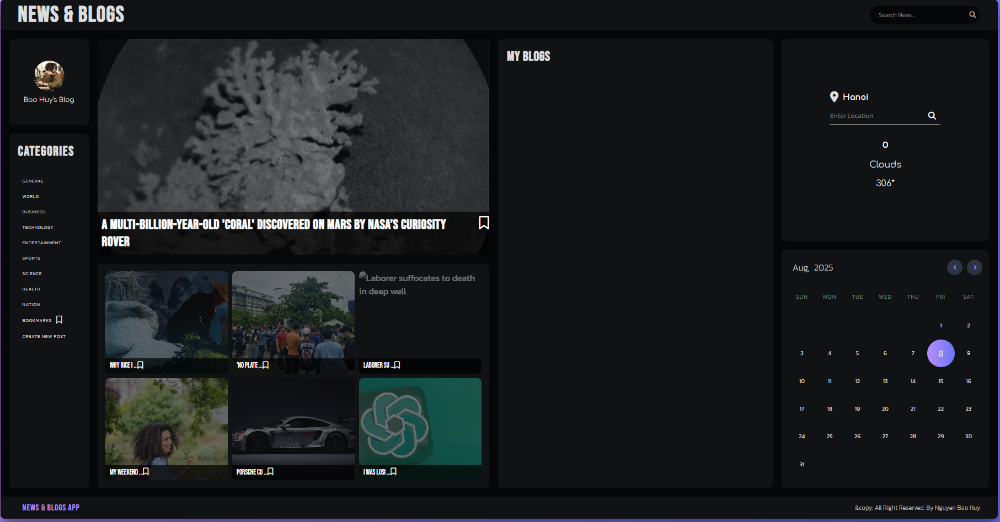
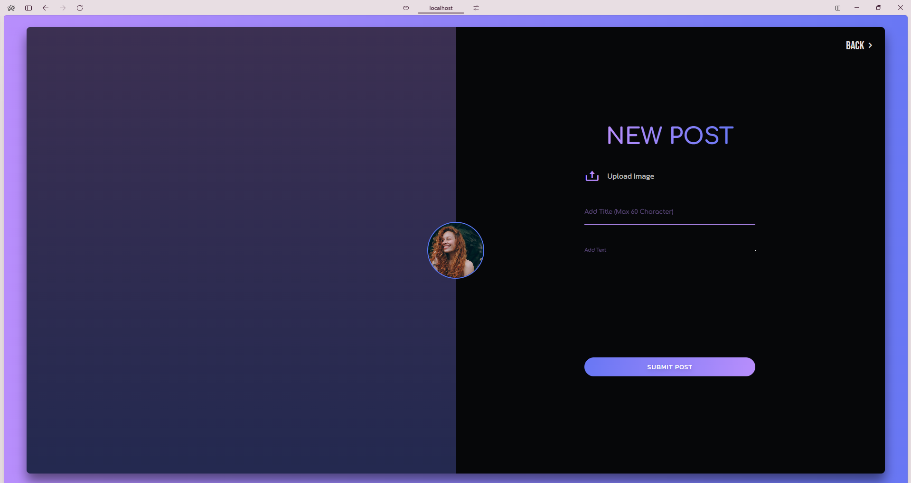
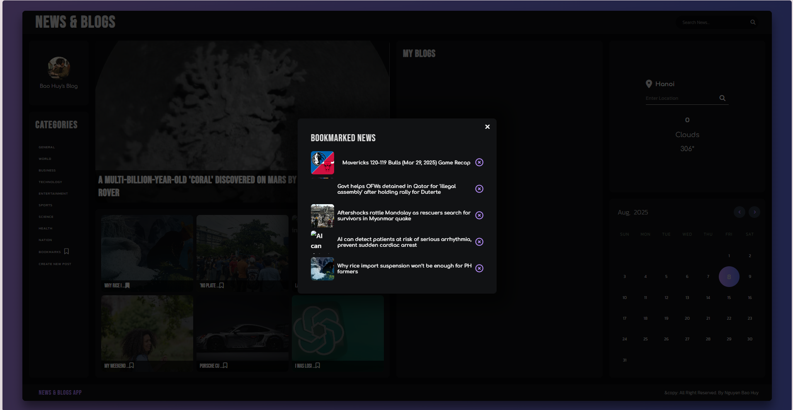

# Project Title

The news and blogs application for everyone. 


## Acknowledgements

This project wouldn't be possible without the support and inspiration from the following:

- 📝 [Windsurf Editor](https://windsurf.com/editor) – for building a customizable, collaborative editor used in our note interface.
- ⚡ [Vercel](https://vercel.com) – for seamless frontend deployment and hosting.
- [Vite](https://vite.dev/) - a build tool that aims to provide a faster and leaner development experience for modern web projects
- [GNews](https://gnews.io/) - for providing api news around the worlds 
- [Openweathermap](https://openweathermap.org/) - for providing api key weather free. 
## Appendix

Primary Sections

- News & Blogs: Main content area featuring articles and blog posts  
- My Blogs: Personal blog section for user-generated content  
- Categories: Organized content classification system  
- Location Services: Weather and location-based information (Hanoi)  


## Authors

- [@baohuy2209](https://github.com/baohuy2209)
- [@baohhhhy2209](https://github.com/baohhhhy2209) 


## Badges

Add badges from somewhere like: [shields.io](https://shields.io/)

[](https://choosealicense.com/licenses/mit/)


## Demo




## Features

A. Website Structure Overview
Primary Sections

- News & Blogs: Main content area featuring articles and blog posts
- My Blogs: Personal blog section for user-generated content
- Categories: Organized content classification system
- Location Services: Weather and location-based information (Hanoi)

Navigation Elements

- Global search functionality
- Category-based filtering
- Bookmark system
- Location-based services
- Calendar integration (August 2025)

B. Content Categories
Available Categories

- General: Broad-interest topics and miscellaneous content
- World: International news and global events
- Business: Economic news, market updates, corporate stories
- Technology: Tech innovations, digital trends, scientific discoveries
- Entertainment: Media, celebrity news, cultural content
- Sports: Athletic events, team updates, sports analysis
- Science: Research findings, scientific breakthroughs, academic content
- Nation: Domestic news and national affairs

C. Featured Content Types
Article Formats

- Breaking News: Time-sensitive current events
- In-depth Features: Comprehensive analysis pieces
- Blog Posts: Personal opinions and editorial content
- Multimedia Stories: Image and video-enhanced articles

Content Examples (as shown)

- Mars exploration discoveries (NASA Curiosity Rover findings)
- Industrial incidents and safety reports
- Automotive industry updates (Porsche features)
- Technology innovations and product launches

D. User Interface Components
Interactive Elements

- Search Bar: Global content search with keyword functionality
- Bookmark System: Save articles for later reading
- Calendar Widget: Date navigation and content scheduling
- Weather Integration: Real-time weather data for user location
- Social Features: Content sharing and user engagement tools

Visual Design Elements

Dark theme interface  
Grid-based content layout  
Thumbnail image previews  
Category color coding  
Responsive design for multiple devices  

E. Technical Specifications
Platform Features

- Mobile App: Dedicated "News & Blogs App" for mobile access
- Location Services: GPS integration for location-specific content
- Cloud Integration: Temperature and weather data (306°)
- Calendar System: Monthly view with date selection
- User Accounts: Personal blog creation and management

Content Management

- Post Creation: "Create New Post" functionality
- Category Assignment: Automatic and manual categorization
- Media Upload: Support for images and multimedia content
- Publishing Tools: Scheduling and content management options

F. User Engagement Features
Personalization

- Location-based content recommendations
- Personal blog creation and management
- Bookmark organization system
- Customizable category preferences

Community Features

- Comment systems (implied)
- Content sharing capabilities
- User-generated blog posts
- Interactive calendar events

G. Content Guidelines and Standards
Editorial Standards

- Factual accuracy in news reporting
- Timely publication of breaking news
- Diverse content across multiple categories
- Professional journalism standards

Technical Standards

- Mobile-responsive design
- Fast loading times
- SEO optimization
- Accessibility compliance
- Cross-platform compatibility

H. Maintenance and Updates
Regular Updates

- Daily news content refresh
- Weather data synchronization
- Calendar maintenance
- User account management
- Security updates and patches

Content Moderation

- Quality control for user-generated content
- Fact-checking for news articles
- Category appropriate placement
- Spam and inappropriate content filtering


## 🚀 About Me
🛠️ I'm currently working on  
Building scalable web applications, implementing automated workflows, and exploring AI model training for real-world applications.

🤝 I'm looking to collaborate on  
Fullstack development projects, custom website designs, blockchain solutions, or anything involving automation with tools like UI Path, n8n, Make, and Zapier.

🆘 I'm looking for help with  
Scaling AI training infrastructure, optimizing low-code automation pipelines, and exploring advanced use cases in blockchain integrations.

🌱 I'm currently learning  
Advanced data analytics with Python and AI model fine-tuning using real-world datasets.

💡 Ask me about  
Freelancing in tech, setting up complex workflow automations, building AI-ready pipelines, or deploying fullstack apps from scratch.

⚡ Fun fact  
I love breaking down complex tech into simple, useful solutions—and I automate everything I can, including coffee reminders ☕⚙️.


## 🛠 Skills
Javascript, HTML, CSS, ReactJS, React Hook, Axios


## Installation

Install my-project with npm

```bash
  npm install
```
    
## License

[MIT](https://choosealicense.com/licenses/mit/)


## Run Locally

Clone the project

```bash
  git clone https://github.com/baohuy2209/reactjsblog.git
```

Go to the project directory

```bash
  cd my-project
```

Install dependencies

```bash
  npm install
```

Start the project

```bash
  npm run dev
```


## Screenshots




## Support

For support, email huynguyen0023@gmail.com or contact zalo [0348403449].
## Tech Stack

**Client:** ReactJS, CSS, Axios 

**Server:** GNews API, Openweathermap API 


## Examples

```javascript
/* eslint-disable react/prop-types */
import React from "react";
import Weather from "./Weather";
import Calendar from "./Calendar";
import "./News.css";
import userImg from "../assets/images/avatar.jpg";
// import techImg from "../assets/images/tech.jpg";
// import sportsImg from "../assets/images/sports.jpg";
// import scienceImg from "../assets/images/science.jpg";
// import worldImg from "../assets/images/world.jpg";
// import healthImg from "../assets/images/health.jpg";
// import nationImg from "../assets/images/nation.jpg";
import noImg from "../assets/images/demo.jpg";
import axios from "axios";
import NewBoxModal from "./NewBoxModal";
import BookMarks from "./BookMarks";
import BlogModal from "./BlogModal";
import { useNavigate } from "react-router-dom";
const categories = [
  "general",
  "world",
  "business",
  "technology",
  "entertainment",
  "sports",
  "science",
  "health",
  "nation",
];
const News = ({ blogs, onEditBlog, onDeleteBlog }) => {
  const [headline, setHeadline] = React.useState(null);
  const [news, setNews] = React.useState([]);
  const [selectedCategory, setSelectedCategory] = React.useState("general");
  const [searchInput, setSearchInput] = React.useState("");
  const [searchQuery, setSearchQuery] = React.useState("");
  const [showModal, setShowModal] = React.useState(false);
  const [selectedArticle, setSelectedArticle] = React.useState(null);
  const [bookmarks, setBookmarks] = React.useState([]);
  const [showBookmarkModel, setShowBookmarkModel] = React.useState(false);
  const [selectedPost, setSelectedPost] = React.useState(null);
  const [showBlogModal, setShowBlogModal] = React.useState(false);
  const navigate = useNavigate();
  const handleBookmarkClick = (article) => {
    setBookmarks((prevBookmarks) => {
      const updatedBookmarks = prevBookmarks.find(
        (bookmarks) => bookmarks.title === article.title
      )
        ? prevBookmarks.filter((bookmark) => bookmark.title !== article.title)
        : [...prevBookmarks, article];
      localStorage.setItem("bookmarks", JSON.stringify(updatedBookmarks));
      return updatedBookmarks;
    });
  };
  const handleSearch = (e) => {
    e.preventDefault();
    setSearchQuery(searchInput);
    setSearchInput("");
  };
  const handleArticleClick = (article) => {
    setSelectedArticle(article);
    setShowModal(true);
  };
  const fetchNews = async (selectedCategory) => {
    const apikey = "49edf7a16072f38adf31dba1be56ea0a";
    let url =
      `https://gnews.io/api/v4/top-headlines?category=${selectedCategory}&lang=en&apikey=` +
      apikey;
    if (searchQuery) {
      url =
        `https://gnews.io/api/v4/search?q=${searchQuery}&lang=en&country=us&max=10&apikey=` +
        apikey;
    }
    const response = await axios.get(url);
    const fetchNews = response.data.articles;
    fetchNews.forEach((article) => {
      if (!article.image) {
        article.image =
          "https://www.google.com/url?sa=i&url=https%3A%2F%2Fwww.vecteezy.com%2Ffree-vector%2Fno-image-available&psig=AOvVaw3Sj8YmL8UUVw_qDh6Fh-TZ&ust=1739431338660000&source=images&cd=vfe&opi=89978449&ved=0CBEQjRxqFwoTCJiDk-rMvYsDFQAAAAAdAAAAABAE";
      }
    });
    setHeadline(fetchNews[0]);
    setNews(fetchNews.slice(1, 7));

    const savedBookmarks = JSON.parse(localStorage.getItem("bookmarks")) || [];
    setBookmarks(savedBookmarks);
  };
  const handleCategoryClick = (e, category) => {
    e.preventDefault();
    setSelectedCategory(category);
  };
  const handleBlogClick = (posted) => {
    setSelectedPost(posted);
    setShowBlogModal(true);
  };
  const handleCloseBlogModal = () => {
    setShowBlogModal(false);
  };
  React.useEffect(() => {
    fetchNews(selectedCategory);
    console.log(blogs);
  }, [selectedCategory, searchQuery]);
  return (
    <div className="news">
      <header className="news-header">
        <h1 className="logo">News & Blogs</h1>
        <div className="search-bar">
          <form onSubmit={handleSearch}>
            <input
              type="text"
              placeholder="Search News..."
              value={searchInput}
              onChange={(e) => setSearchInput(e.target.value)}
            />
            <button type="submit">
              <i className="fa-solid fa-magnifying-glass"></i>
            </button>
          </form>
        </div>
      </header>
      <div className="news-content">
        <div className="navbar">
          <div className="user">
            
            <p>Bao Huy&apos;s Blog</p>
          </div>
          <nav className="categories">
            <h1 className="nav-heading">Categories</h1>
            <div className="nav-links">
              {categories.map((category, index) => (
                <a
                  href="#"
                  key={index}
                  className="nav-link"
                  onClick={(e) => handleCategoryClick(e, category)}
                >
                  {category}
                </a>
              ))}
              <a
                href="#"
                className="nav-link"
                onClick={() => setShowBookmarkModel(true)}
              >
                Bookmarks <i className="fa-regular fa-bookmark"></i>
              </a>
              <a href="/blogs" className="nav-link">
                Create new post
              </a>
            </div>
          </nav>
        </div>
        <div className="news-section">
          {headline && (
            <div
              className="headline "
              onClick={() => handleArticleClick(headline)}
            >
              
              <h2 className="headline-title">
                {headline.title}
                <i
                  className={`${
                    bookmarks.some(
                      (bookmark) => bookmark.title === headline.title
                    )
                      ? "fa-solid"
                      : "fa-regular"
                  } fa-bookmark bookmark`}
                  onClick={(e) => {
                    e.stopPropagation();
                    handleBookmarkClick(headline);
                  }}
                ></i>
              </h2>
            </div>
          )}

          <div className="news-grid">
            {news.map((article, index) => (
              <div
                key={index}
                className="news-grid-item"
                onClick={() => handleArticleClick(article)}
              >
                
                <h3>
                  {article.title.substring(0, 10)} ...
                  <i
                    className={`${
                      bookmarks.some(
                        (bookmark) => bookmark.title === article.title
                      )
                        ? "fa-solid"
                        : "fa-regular"
                    } fa-bookmark bookmark`}
                    onClick={(e) => {
                      e.stopPropagation();
                      handleBookmarkClick(article);
                    }}
                  ></i>
                </h3>
              </div>
            ))}
          </div>
        </div>
        <NewBoxModal
          show={showModal}
          article={selectedArticle}
          onClose={() => setShowModal(false)}
        />
        <BookMarks
          show={showBookmarkModel}
          bookmarks={bookmarks}
          onClose={() => setShowBookmarkModel(false)}
          onSelectArticle={handleArticleClick}
          onDeleteBookmark={handleArticleClick}
        />
        <div className="my-blogs">
          <h1 className="my-blogs-heading">My Blogs</h1>
          <div className="blog-posts">
            {blogs.map((blog, index) => (
              <div
                key={index}
                className="blog-post"
                onClick={() => handleBlogClick(blog)}
              >
                
                <h3>{blog.title}</h3>
                <div className="post-buttons">
                  <button
                    className="edit-post"
                    onClick={() => {
                      onEditBlog(blog);
                      navigate("/blogs");
                    }}
                  >
                    <i className="bx bxs-edit"></i>
                  </button>
                  <button
                    className="delete-post"
                    onClick={(e) => {
                      e.stopPropagation();
                      onDeleteBlog(blog);
                    }}
                  >
                    <i className="bx bxs-x-circle"></i>
                  </button>
                </div>
              </div>
            ))}
          </div>
          <BlogModal
            showBlogModal={showBlogModal}
            selectedPost={selectedPost}
            onClose={handleCloseBlogModal}
          />
        </div>
        <div className="weather-calendar">
          <Weather />
          <Calendar />
        </div>
      </div>
      <footer className="news-footer">
        <p>
          <span>News & Blogs App</span>
        </p>
        <p>&copy: All Right Reserved. By Nguyen Bao Huy</p>
      </footer>
    </div>
  );
};

export default News;
```

